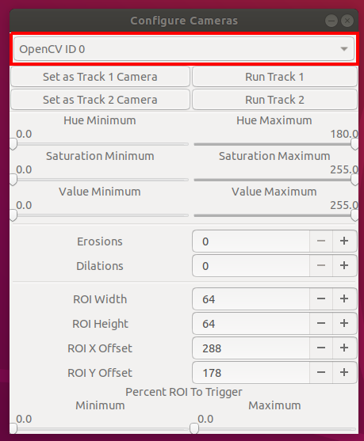

# tulsa-rollercoaster-camera

## Overview

This program is intended to run the solar coaster at the Tulsa Discovery Center. It uses OpenCV to identify when the cameras in the control turrets are directed at the coaster cars, and runs the track the car is sitting on when that happens.

This is performed by color thresholding. When an image is taken from a camera, the image is converted to [HSV](https://en.wikipedia.org/wiki/HSL_and_HSV) and then thresholded with both minimum and maximum values for hue, saturation, and value. This produces a mask that, when the min/max HSV values are properly calibrated, should strip away most of the background elements, leaving only the rollercoaster car in the image. Erosion is applied to the mask to remove background elements, and then the mask is dilated to fill the foreground elements. Finally, the mask is checked in a specified region. If the percentage of active pixels in the region is between some minimum and maximum, the camera is considered "triggered" and the corresponding track is turned on. If the camera is not triggered, the track is turned off.

## Glossary of Terms

- **HSV:** An alternative color model designed to more closely mimic how the human eye perceives color. The HSV model is useful because it permits regions of similar color to be identified even if one is in shadow and the other brightly lit. It consists of three components:
    - **hue**, which describes the overall color, cycling through ROYGBIV
    - **saturation**, which describes how "saturated" or vibrant a color is;
    - **value**, which describes how bright (high value) or dark (low value) a color is.


- **Erosion:** An operation that reduces the size of solid white regions in an image. Erosion works by checking if each pixel has at least one black adjacent pixel; if it does, that pixel is set to black, and otherwise is unchanged. Erosion is used to remove small background elements.
- **Dilation:** The opposite of erosion. If a pixel has a white neighbor, it is set to white, thereby increasing the area of solid white regions. Dilation is used to close holes in foreground elements.

## Configurator UI Overview

### Camera Selector

A dropdown containing a list of all cameras connected to your system.



### Track Controls

The "Set as Track" buttons determine which of the tracks the currently selected camera controls. The "Run Track" buttons directly turn on the indicated track as long as it's held down.


### HSV Sliders

These sliders determine the minimum and maximum HSV values for the color thresholding on the present camera.


### Erosion/Dilation Controls

Controls the number of erosions and dilations applied to the present camera's mask before determining triggering.


### ROI Controls

Width/Height control the size and shape of the region checked for triggering. X/Y offsets control the ROI position in the image. Min/max percentages control how the present camera triggers.


## Configuration Tutorial

When first starting up the configurator, you should see something like the following.


Here, I will demonstrate how to configure the camera to trigger when pointed at the red marker cap.

To begin, start increasing the hue minimum. You will notice that elements of the background begin to fall away as you do this.


As you keep increasing, eventually parts of the object we want to trigger off of will be removed.


This means that we've pushed the hue minimum too high. Bring it back down, trying to find the place just before elements of the object we want are removed from the mask.


Similarly, begin bringing hue maximum down until parts of the object of interest are removed. Once this happens, push it back up to the point just before that starts happening. In this case, moving the max hue below 180 causes parts of the cap to disappear.

Repeat this process with saturation and value: push the minimum up until just before the object we want disappears, then pull the maximum down until the same occurs.

Once the HSV parameters are where we want them, you should have a reasonably crisp mask, with only a bit of background noise, as shown below.


Applying erosion will shrink the size of all elements, eventually totally eliminating that background noise. Unfortunately, it also increases the size of holes in our object.


Fortunately, dilation reduces the size of holes. Increase the dilation parameter until the object we want is reasonably whole.


Adjusting the ROI parameters is an art more than a science. Under most circumstances the default width/height and X/Y offset should be OK. A reasonable baseline for the minimum and maximum percentages is 25% and 100%.

When the camera is triggered, it will turn the ROI box green (as well as run a track, if it is configured to control one):


You do not need to save your configurations; they will save automatically on closing the program.

> **WARNING** Make sure to close the "Configure Cameras" window when exiting. Closing the "Terminal" window will kill the process before it has a chance to save your changes!

> **WARNING II** The program only saves settings for the Track 1 & Track 2 cameras. If you haven't set a camera to control one of the tracks, its settings will **not** be saved.

## Building the programs

Compiling requires cmake, GTK3, pkg-config, OpenCV, and libserialport. Clone the repository with `git clone https://github.com/scimusmn/tulsa-rollercoaster-camera.git`, and then type

```
cd tulsa-rollercoaster-camera  
cmake .  
make
```

This will produce a `bin/` directory containing the executables and required resources for running them.

If you want to add these programs to the desktop, or add them to startup, type `nano ~/bin/config.sh`, and then type

```
cd [PATH TO REPOSITORY]/tulsa-rollercoaster-camera/bin/
./config
```

Press `Ctrl-O` to save and `Ctrl-X` to exit. Type

```
cp ~/bin/config.sh ~/bin/rollercoaster.sh  
nano ~/bin/rollercoaster.sh
```

and then change `./config` to `./rollercoaster`, and then `Ctrl-O Ctrl-X`.

Finally, make the files executable by typing `chmod 740 ~/bin/*`. Now you can run `config` by simply opening a terminal and typing `config.sh`, and `rollercoaster` by typing `rollercoaster.sh`. (On a preinstalled system, these have also been added to the desktop as "Rollercoaster" and "Rollercoaster Configurator").

**To add to `rollercoaster` to startup:** (Ubuntu) Press `Start` and type `startup`, and click on "Startup Applications Preferences". Click "Add", name it whatever you like, and then type into the "Command" line:

```
gnome-terminal --command "rollercoaster.sh"
```

